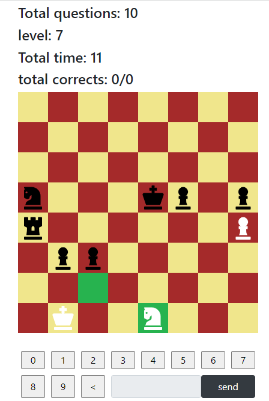

# chessmemo

# What it does

- It is a game I though after programming the counter letters game.
- Basically you received a chess position and you have to give how many valid moves has the next player.
- You can program difficulty by defining how many positions and how many pieces over the boards you want.
- It has more than 8000 positions randomly generated (simulating chess games with random valid movements, which I did in my chess_positions_rb project). I would like to provide more positions but free Heroku don't let me =(.
- You need to login. No need to provide a real email.
- It provides some stats about your performance, best scores and recent scores.

## Related projects

- [chessmemo](https://github.com/andresporras3423/chessmemo) (backend code for this project)
- [chess_positions_rb](https://github.com/andresporras3423/chess_positions_rb) (to generate the positions)

## Built With

- HTML5.
- CSS3.
- Bootstrap.
- React.js.
- JavaScript.
- Netlify (frontend deploy).
- Heroku (backend deploy).
- Ruby.
- Ruby on Rails.

## Live Version

[Live](https://andresporras-chessmemo.netlify.app/)

## Authors

**Oscar Russi**
- Github: [@andresporras3423](https://github.com/andresporras3423/)
- Linkedin: [Oscar Russi](https://www.linkedin.com/in/oscar-andres-russi-porras/)
- Twitter: [@OscarRussi1](https://twitter.com/OscarRussi1)

## 🤝 Contributing

This is a project for educational purposes only. We are not accepting contributions.

## Attributions and Credit

Special thanks to Microverse, for this learning opportunity. 

## Show your support

Give a ⭐️ if you like this project!

## Enjoy!
